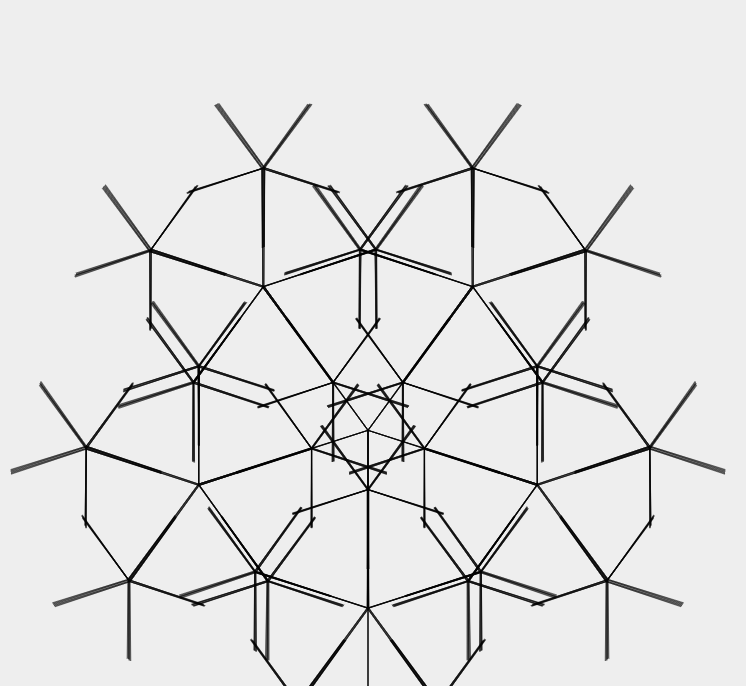

# Simple Tree JS Animation Project

This project demonstrates a simple tree animation created using JavaScript and HTML5 Canvas. The animation shows a tree growing from a seed.
## Screenshots

## Features

- **Tree Animation**: The canvas animation shows a tree growing from a seed, with branches expanding over time.
- **Interactive**: The tree growth can be controlled with a start and reset button.
- **Customizable**: The tree's appearance, such as the color, branch length, and angle, can be customized.

## Prerequisites

No special prerequisites are required. Just a modern web browser to view the HTML and JavaScript files.

## Installation

No installation is necessary. You can view the project by opening the `index.html` file in your web browser.

## Usage

Simply open the `index.html` file in your browser to view the tree animation. Use the "Start" and "Reset" buttons to control the animation.

## Customization

The tree's appearance can be customized by modifying the parameters in the `scripts.js` file. For example, you can change the `branchLength`, `branchAngle`, and `leafColor` variables to adjust the look of the tree.

## License

This project is licensed under the MIT License - see the [LICENSE.md](LICENSE.md) file for details.
